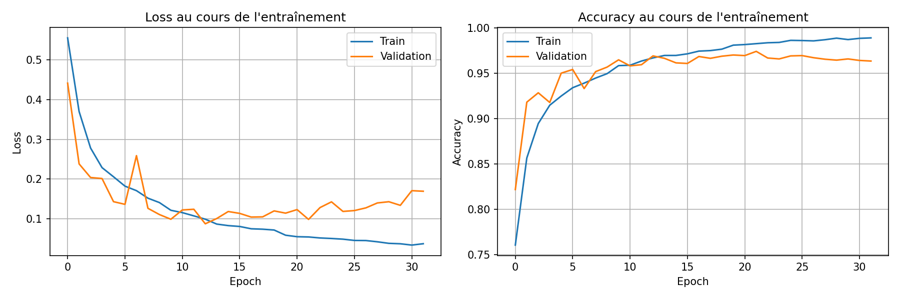

# Compte Rendu — Partie 3 : Oracle du Donjon

**Cours** : INFO905 — Deep Learning
**Auteurs** : Abrantes-Alfredo, Messaoud-Djebara

---

## 1. Objectif

Prédire la **survie d'aventuriers** dans un donjon à partir de **séquences d'événements** (combats, pièges, soins, trésors…). Il s'agit d'un problème de **classification binaire de séquences** où l'ordre des événements est déterminant : par exemple, `Potion → Dragon` mène à la survie, tandis que `Dragon → Potion` mène à la mort.

## 2. Données

| | Train | Validation |
|---|---|---|
| **Séquences** | 3 500 | 500 (environ) |

- **Vocabulaire** : 45 tokens (événements de donjon : monstres, pièges, soins, trésors, boss…)
- **Longueur max** : 140 tokens par séquence
- **Format** : séquences textuelles (`Entree -> Rat -> Potion -> ... -> Sortie`), converties en IDs via un vocabulaire JSON
- **Padding** : `<PAD>` (index 0), tokens inconnus : `<UNK>` (index 1)

## 3. Architecture du modèle

Le modèle **DungeonOracle** suit l'architecture `Embedding → BiLSTM → Classifier` :

```
Embedding(45, 32, padding_idx=0)
    ↓
Dropout(0.3)
    ↓
BiLSTM(input=32, hidden=64, layers=2, dropout=0.3)
    ↓  (concaténation hidden forward + backward → 128)
Classifier:
    Linear(128, 64) → ReLU → Dropout(0.3) → Linear(64, 1)
```

Le packing des séquences (`pack_padded_sequence`) est utilisé pour ignorer le padding et traiter efficacement les séquences de longueur variable.

## 4. Améliorations par rapport au baseline

Le modèle baseline fourni contenait des **défauts volontaires** à corriger. Voici les modifications apportées :

| Paramètre | Baseline | Amélioré | Justification |
|---|---|---|---|
| `embed_dim` | 2 | **32** | Dimension trop faible → perte d'information sémantique |
| `mode` | linear | **lstm** | Un simple MLP aplati ne capture pas les dépendances temporelles |
| `hidden_dim` | 258 | **64** | Baseline surdimensionné ; 64 suffit avec un LSTM bidirectionnel |
| `num_layers` | 1 | **2** | Permet de capturer des patterns plus complexes |
| `dropout` | 0.0 | **0.3** | Régularisation contre l'overfitting |
| `bidirectional` | False | **True** | Le contexte futur aide à la classification (ex. présence d'un boss en fin de séquence) |
| `pos_weight` | — | **ajouté** | Pondération de la loss pour corriger un éventuel déséquilibre de classes |
| `weight_decay` | 0.0 | **1e-4** | Régularisation L2 des poids |

## 5. Hyperparamètres finaux

| Hyperparamètre | Valeur |
|---|---|
| Embedding dim | 32 |
| Hidden dim (LSTM) | 64 |
| Couches LSTM | 2 |
| Bidirectionnel | Oui |
| Dropout | 0.3 |
| Optimiseur | Adam |
| Learning rate | 0.001 |
| Weight decay | 1e-4 |
| Batch size | 32 |
| Epochs | 50 |
| Scheduler | ReduceLROnPlateau (factor=0.5, patience=5) |
| Early stopping | Activé (patience=7) |
| Gradient clipping | max_norm=1.0 |
| Loss | BCEWithLogitsLoss (avec pos_weight) |

## 6. Résultats

### Métriques finales

| Métrique | Valeur |
|---|---|
| **Best val accuracy** | **97.67%** (epoch 45) |
| Final train accuracy | 98.64% |
| Final val accuracy | 97.23% |
| Final train loss | 0.0404 |
| Final val loss | 0.0986 |
| Epochs complétées | 50 (early stopping non déclenché) |

### Progression de l'entraînement

| Epoch | Train Acc | Val Acc | Train Loss | Val Loss |
|---|---|---|---|---|
| 1 | 75.94% | 87.00% | 0.5659 | 0.3524 |
| 5 | 91.93% | 94.03% | 0.2192 | 0.1513 |
| 10 | 94.08% | 95.27% | 0.1610 | 0.1421 |
| 20 | 96.53% | 96.70% | 0.0993 | 0.0951 |
| 30 | 97.46% | 97.17% | 0.0746 | 0.0855 |
| 40 | 97.86% | 97.33% | 0.0657 | 0.0797 |
| 45 | 98.51% | **97.67%** | 0.0462 | 0.0833 |
| 50 | 98.64% | 97.23% | 0.0404 | 0.0986 |

### Courbes d'entraînement



## 7. Analyse

- **Bonne généralisation** : le gap train-val est de seulement **~1.4%** à la fin de l'entraînement, ce qui indique une très faible tendance à l'overfitting.
- **Convergence rapide** : le modèle atteint ~95% de val accuracy dès l'epoch 5-10, puis se stabilise progressivement.
- **Régularisation efficace** : la combinaison dropout (0.3) + weight decay (1e-4) + gradient clipping maintient le modèle bien régularisé.
- **Pas d'early stopping déclenché** : les 50 epochs se sont déroulées complètement, le modèle continuant à progresser lentement.
- **LSTM bidirectionnel justifié** : la capacité à lire la séquence dans les deux sens est cruciale pour ce type de données où des événements tardifs (boss, sortie) influencent la classification.
- **Pourquoi le LSTM surpasse le baseline linéaire** : le modèle linéaire aplatit la séquence et perd toute notion d'ordre et de dépendances temporelles. Le LSTM, grâce à son état caché (cell state), préserve les dépendances à long terme — par exemple, un soin reçu 20 événements avant un combat avec un boss.
